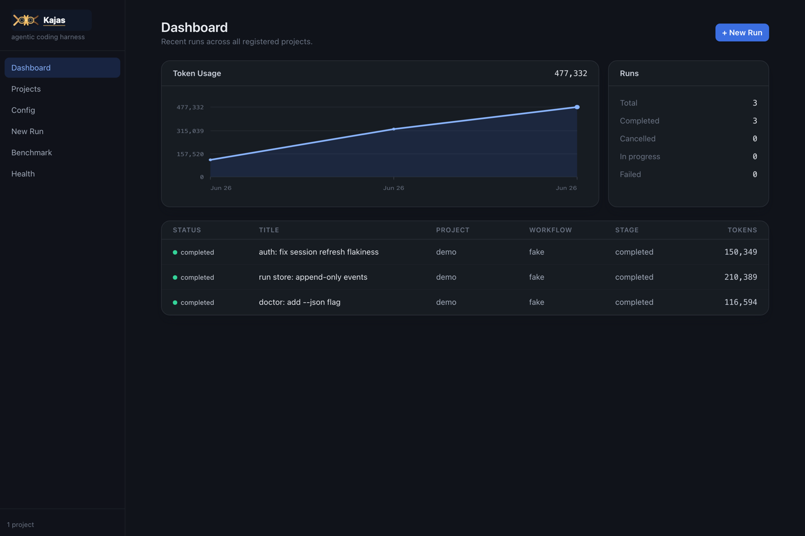
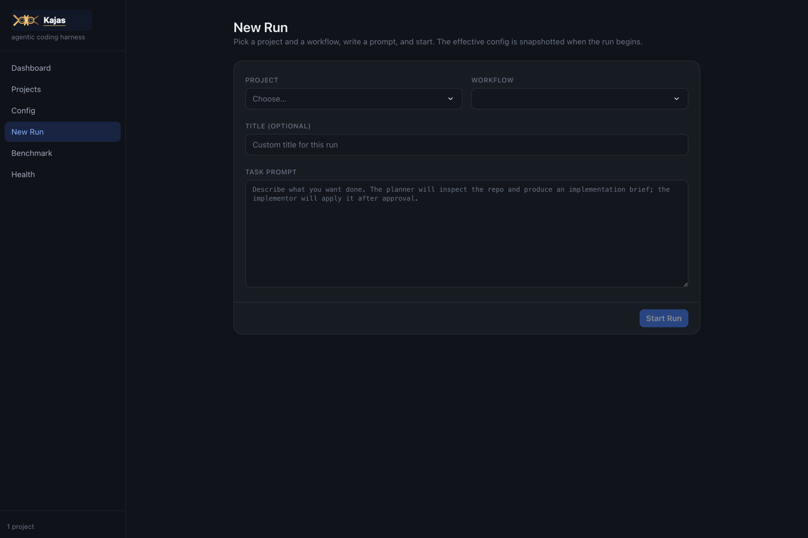
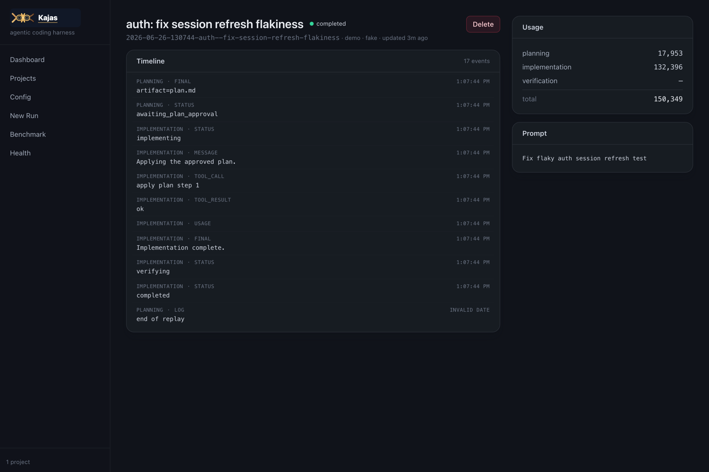
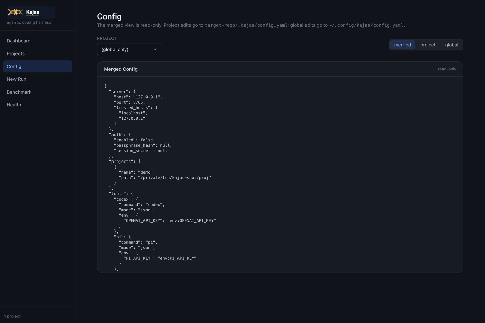
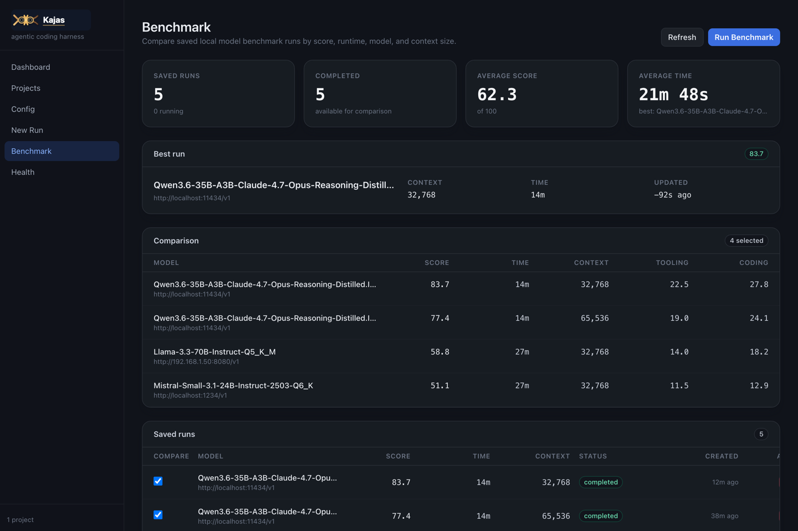
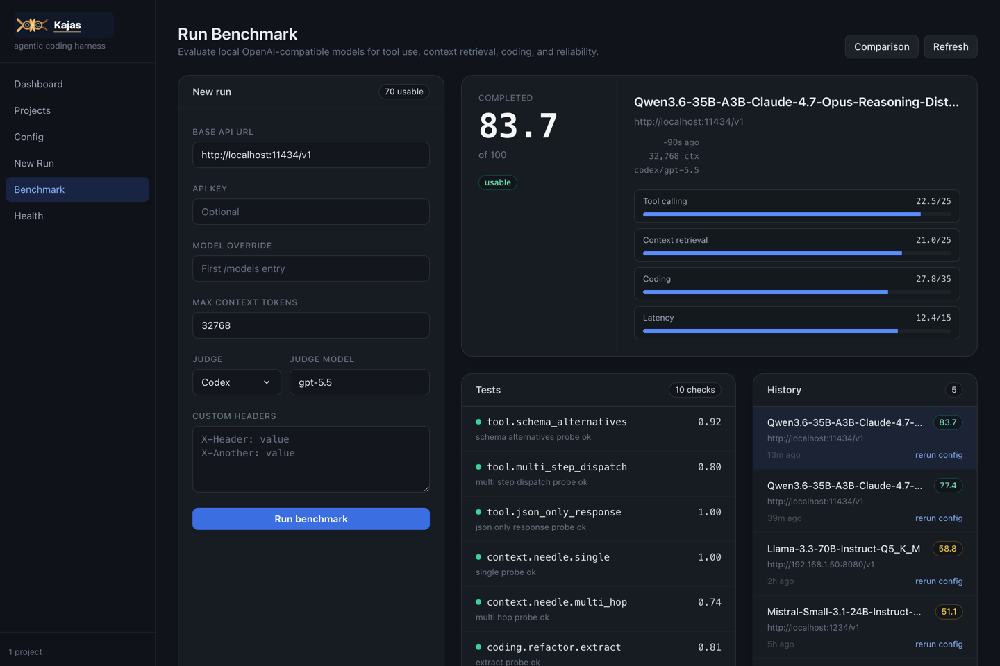
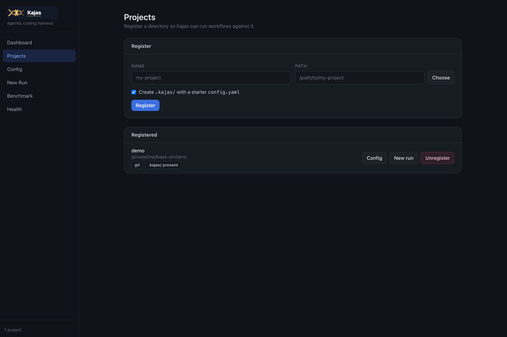
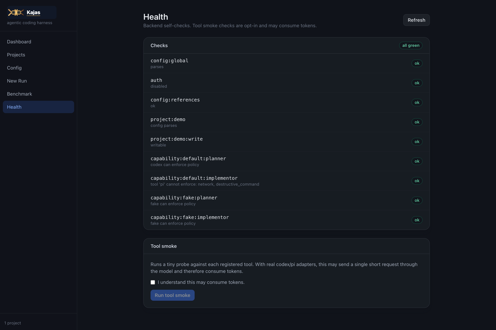

# Kajas

> Local-first harness for running agentic coding workflows from a Web UI.

Bundled desktop app: **v0.1.0** · Python backend `0.1.0` ·
Frontend `0.1.0` — prebuilt for macOS Apple Silicon:
[`Kajas-0.1.0-macos-arm64.dmg`](https://github.com/nikolasp/kajas/releases/download/v0.1.0/Kajas-0.1.0-macos-arm64.dmg) (see [Desktop App](#desktop-app-bundled-v010) for the unsigned-install steps).

Kajas runs on your own machine. Pick a project and a workflow, write
a task prompt, review the generated plan when configured to pause, then
let the configured agent profiles do the implementation while Kajas
records state, logs, approvals, and token usage in project-local
files. Everything stays on disk under `<repo>/.kajas/` — no cloud, no
telemetry.

See [`docs/kajas-v1-design.md`](docs/kajas-v1-design.md) for the full
V1 design.

## Screenshots

The same UI runs in the browser (`kajas serve`) and inside the bundled
desktop app.

| | |
|:---:|:---:|
| [](docs/screenshots/dashboard.png) | [](docs/screenshots/new-run.png) |
| **Dashboard** — recent runs across all registered projects, token usage at a glance. | **New Run** — pick project + workflow, write a prompt, see the effective merged config. |
| [](docs/screenshots/run-detail.png) | [](docs/screenshots/config.png) |
| **Run Detail** — live timeline of normalized events, tool calls, usage, and the original prompt. | **Config** — read-only merged view; edits go to the global or project YAML. |

### Benchmark

Score local OpenAI-compatible models (llama.cpp, Ollama, LM Studio, …) across tool calling, context retrieval, coding, and latency, then compare saved runs.

| | |
|:---:|:---:|
| [](docs/screenshots/benchmark.png) | [](docs/screenshots/benchmark-run.png) |
| **Benchmark** — compare saved runs by score, runtime, model, and context size. | **Run Benchmark** — launch a model eval; scoreboard, per-test results, and history. |

<details>
<summary>More views</summary>

| | |
|:---:|:---:|
| [](docs/screenshots/projects.png) | [](docs/screenshots/health.png) |
| **Projects** — register repos so Kajas can run workflows against them. | **Health** — backend self-checks and opt-in tool smoke tests. |
</details>

## Stack

- **Backend**: Python 3.11+ / FastAPI / uvicorn.
- **Frontend**: React 18 / Vite / Tailwind CSS / TypeScript, served
  through the FastAPI process in production.
- **Desktop**: Tauri v2 shell that launches the Python backend as a
  sidecar and opens a native webview on the served UI.
- **Adapters**: Codex CLI, Pi CLI, plus a built-in `fake` adapter for
  tests and demos.
- **Auth**: Argon2id passphrase + signed session cookie (HttpOnly,
  SameSite=Lax).
- **State**: global YAML config at `~/.config/kajas/config.yaml`,
  per-project config at `<repo>/.kajas/config.yaml`. Per-run artifacts
  under `<repo>/.kajas/runs/<id>/`.

## Quick Start (Web UI)

```bash
# 1. Install backend deps and the kajas package
pip install -e backend/

# 2. Install frontend deps
cd frontend && npm install && cd ..

# 3. Write a starter global config and set a passphrase
kajas init           # writes config.yaml; prompts for a passphrase

# 4. Start the dev server (backend on :8765, Vite on :5173)
make dev             # or: ./kajas --dev
```

Open <http://127.0.0.1:5173> and sign in with the passphrase you set
in step 3.

Dev server settings can be adjusted with environment variables:

| Variable | Default | Purpose |
| --- | --- | --- |
| `KAJAS_VITE_HOST` | `0.0.0.0` | Host Vite binds to. |
| `KAJAS_VITE_PORT` | `5173` | Vite dev server port. |
| `KAJAS_VITE_ALLOWED_HOSTS` | unset | Comma-separated host allow-list for Vite. Use `*` to allow any host. |
| `KAJAS_API_PROXY_TARGET` | `http://127.0.0.1:8765` | Backend target for Vite's `/api` proxy. |

For example, to reach Vite through a specific hostname:

```bash
KAJAS_VITE_HOST=0.0.0.0 KAJAS_VITE_ALLOWED_HOSTS=my-host.example.com make dev
```

The starter global config includes the default real workflow:

```yaml
agents:
  planner:
    tool: codex
    model: gpt-5.5
    role: planner
  coder:
    tool: pi
    model: Qwen3.6-35B-A3B-Claude-4.7-Opus-Reasoning-Distilled.IQ4_XS.gguf
    role: implementor
    extra:
      local_model: Qwen3.6-35B-A3B-Claude-4.7-Opus-Reasoning-Distilled.IQ4_XS.gguf
workflows:
  default:
    planner: planner
    implementor: coder
```

For production-ish use, build the frontend once and serve it from the
FastAPI process:

```bash
cd frontend && npm run build && cd ..
kajas serve --frontend-dir frontend/dist
```

## Desktop App (bundled, v0.1.0)

Kajas ships as a single native desktop app under
`frontend/src-tauri/`. The Tauri v2 shell starts the Python backend on
localhost, serves the built Vite UI through that backend, and opens a
native webview window against it — so the desktop app and the Web UI
are the same UI.

The bundled app version lives in three places that are kept in sync:

| File | Field |
| --- | --- |
| `frontend/src-tauri/tauri.conf.json` | `version` |
| `frontend/src-tauri/Cargo.toml` | `version` (the `kajas-desktop` crate) |
| `frontend/package.json` | `version` (matches the UI build) |
| `backend/pyproject.toml` | `version` (the Python backend/sidecar) |

All read **0.1.0** for this release.

### Download

A prebuilt macOS disk image is published on GitHub Releases for each
version. The current release is **v0.1.0**:

→ **[Kajas-0.1.0-macos-arm64.dmg](https://github.com/nikolasp/kajas/releases/download/v0.1.0/Kajas-0.1.0-macos-arm64.dmg)** (Apple Silicon, ~21 MB)

| | |
| --- | --- |
| Target | macOS 11+ on Apple Silicon (arm64) |
| SHA-256 | `d1011ef932b18f22100b2f84c221961375cc18fd2d9bf338e67231224a6605b0` |
| Signing | ad-hoc signed — **not** notarized |

The build is unsigned, so Gatekeeper will block a double-click open.
There is no Intel (x86_64) prebuilt yet — see [Building from source](#build)
below.

**Installing on macOS (unsigned app):**

1. Download the `.dmg` above and verify the checksum:
   ```bash
   shasum -a 256 Kajas-0.1.0-macos-arm64.dmg
   # expect: d1011ef932b18f22100b2f84c221961375cc18fd2d9bf338e67231224a6605b0
   ```
2. Open the `.dmg`, drag **Kajas** into **Applications**.
3. Clear the quarantine attribute **before** first launch (one-time):
   ```bash
   xattr -cr /Applications/Kajas.app
   ```
   …or right-click **Kajas.app** → **Open** → confirm **Open** at the
   Gatekeeper prompt the first time.
4. Launch Kajas. It starts the local Python backend and opens the webview.

> ⚠️ Because the app is ad-hoc signed, any macOS user can run it, but
> they must perform step 3 above. A notarized build requires an Apple
> Developer ID; see `releases/README.md` for the notarization TODO.

### What gets bundled

Desktop builds package the Python backend as a Tauri sidecar with
PyInstaller, so the installed app does not need `python3 -m kajas.cli`
or any Python environment at runtime. The sidecar binary lives under
`frontend/src-tauri/binaries/`.

`tauri.conf.json` sets `bundle.targets: "all"`, so per platform you get:

| OS | Bundles |
| --- | --- |
| Linux | `.deb`, `.rpm`, and `.AppImage` |
| macOS | `.app` and `.dmg` |
| Windows | `.msi` and `.exe` (NSIS) |

### Prerequisites

- Rust/Cargo via <https://rustup.rs/>.
- Python 3 plus `venv` support for the local PyInstaller packaging
  environment.
- The frontend dependencies installed with `npm install` in
  `frontend/`.

### Run and build

From the `frontend/` package:

```bash
# Run the desktop app against the current source (live backend sidecar build)
npm run desktop:dev

# Produce a local desktop binary without bundling installers
npm run desktop:build

# Produce all configured installers for this host (deb/rpm/AppImage on Linux, etc.)
npm run desktop:bundle

# Linux packages only (deb + rpm)
npm run desktop:bundle:linux-packages
```

### Runtime behavior

By default the wrapper launches `python3 -m kajas.cli serve` with
`PYTHONPATH` pointed at `../backend` only when running from source or
when `KAJAS_BACKEND_CMD` is set. Packaged apps launch the bundled
`kajas-backend` sidecar. Override `KAJAS_DESKTOP_PORT` if port `8765`
is not available.

<a id="build"></a>
### Build from source

To produce the same `.dmg` locally (e.g. for Intel Macs, or to inspect
the build):

```bash
cd frontend
npm install
npm run tauri -- build --bundles dmg
# -> frontend/src-tauri/target/release/bundle/dmg/Kajas_0.1.0_aarch64.dmg
```

Override `--target` for a different architecture if your toolchain
supports it. See `releases/README.md` for the full publish recipe.

## CLI

```text
kajas init                  # write starter global config, set passphrase
kajas serve [--host H] [--port P] [--frontend-dir DIR]
kajas init-project NAME PATH [--no-bootstrap-dir]
kajas run --project NAME --workflow NAME --prompt "..." [--delete]
kajas doctor [--tool-smoke | --no-tool-smoke]
```

`kajas run` is a headless, auto-approving version of the Web UI's
"New Run" flow. It is convenient for smoke tests and CI.

## API

The full HTTP/SSE surface is mounted under `/api`:

| Method | Path | Purpose |
| --- | --- | --- |
| `POST` | `/api/auth/login` | sign in with the local passphrase |
| `POST` | `/api/auth/logout` | sign out |
| `POST` | `/api/auth/bootstrap` | first-run passphrase setup |
| `GET`  | `/api/auth/status` | is auth enabled? do we need to bootstrap? |
| `GET`  | `/api/dashboard` | recent runs across all projects |
| `GET`  | `/api/projects` | list registered projects |
| `POST`  | `/api/projects` | register a project and bootstrap `.kajas/` |
| `DELETE` | `/api/projects/{name}` | unregister (keeps files) |
| `GET`  | `/api/config/global` | read global config |
| `PUT`  | `/api/config/global` | write global config |
| `GET`  | `/api/config/project?project=…` | read project config |
| `PUT`  | `/api/config/project?project=…` | write project config |
| `GET`  | `/api/config/merged?project=…` | read merged config (read-only) |
| `POST` | `/api/runs` | create + start a run |
| `GET`  | `/api/runs/{id}` | run summary + persisted state |
| `GET`  | `/api/runs/{id}/events/stream` | SSE event stream |
| `POST` | `/api/runs/{id}/approve-plan` | approve (optionally edit) the plan |
| `POST` | `/api/runs/{id}/cancel` | graceful cancel |
| `DELETE` | `/api/runs/{id}` | delete run folder |
| `GET`  | `/api/health` | basic checks |
| `POST` | `/api/health/tool-smoke` | opt-in tool smoke checks |

## Project Layout

```text
backend/kajas/
  cli.py          # argparse CLI
  server.py       # FastAPI app
  auth.py         # argon2 + session cookie
  config.py       # YAML schemas, deep merge, validation
  projects.py     # project registry + bootstrap
  runs.py         # run orchestrator + state machine
  run_store.py    # persistent run store
  benchmarks.py   # benchmark tasks
  doctor.py       # basic + tool-smoke checks
  adapters/
    base.py       # Adapter / NormalizedEvent / HealthResult
    fake.py       # in-process fake (Milestone 1)
    codex.py      # codex exec --json (Milestone 2)
    pi.py         # pi --mode json (Milestone 2)
frontend/src/
  App.tsx
  main.tsx
  lib/{api,types,format}.ts
  pages/{Dashboard,Projects,Config,NewRun,RunDetail,Health,Login,Benchmark,BenchmarkRun}.tsx
  components/StatusPill.tsx
frontend/src-tauri/      # Tauri v2 desktop shell + sidecar packaging
docs/kajas-v1-design.md
tests/                # pytest suite (config, auth, runs, API)
```

## Tests

```bash
python3 -m pytest tests/
```

The test suite uses a fake workflow and the FastAPI TestClient; it
does not invoke real Codex or Pi. The fake adapter supports hints
embedded in the prompt, e.g. `<!-- kajas:fake mode=fail -->` to
exercise the failure path.

## Status

- **M1 (delivered)**: vertical skeleton with fake adapters, full
  config + auth + project model, dashboard / projects / config / new
  run / run detail / health UI, plan-approval gate, cancellation,
  restart-as-interrupted, basic doctor checks.
- **M2 (delivered)**: real Codex and Pi adapters (best-effort
  translation of the tool-specific event formats into
  `NormalizedEvent`).
- **M3 (partial)**: verification command execution and recording,
  plan amendment flow. Resume/rerun from plan or implementation is
  intentionally left as a follow-up.

## License

MIT — see the `license` field in [`backend/pyproject.toml`](backend/pyproject.toml).